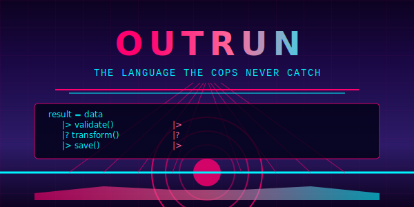

# Outrun

<div align="center">
  
</div>

> *A statically-typed, functional programming language where everything is a trait*

## 🎵 About Outrun

Outrun is a modern programming language designed around the principle that **everything is a trait**. Born from the desire to build elegant, type-safe systems without sacrificing expressiveness, Outrun brings together the best ideas from functional programming, trait-based polymorphism, and actor-model concurrency.

Named after the retro-futuristic aesthetic of synthwave music and 80s culture, Outrun aims to capture that same sense of speed, style, and limitless possibility in code.

## ✨ Key Features

### 🎯 Everything is Traits
```outrun
# Operators are just trait method calls
result = value |> transform() |? validate() |> save()
# |> calls Pipe.pipe_into(), |? calls Maybe.maybe_pipe()

# Even attributes are traits!
@Derive(traits: [Debug, Clone])
struct User(name: String, email: String) {}
```

### 🏷️ Named Parameters Only
```outrun
# Crystal clear function calls
user = User.create(
    name: "Neo", 
    email: "neo@matrix.io"
)

# No confusion about argument order
divide(numerator: 10, denominator: 2)
```

### 🛡️ Powerful Guard System
```outrun
def divide(a: Integer, b: Integer): Result<Float, Error>
when Integer.non_zero?(b) {
    Ok(Float.from_integer(a) / Float.from_integer(b))
}

def divide(a: Integer, b: Integer): Result<Float, Error>
when Integer.zero?(b) {
    Err(DivisionByZero("Cannot divide by zero"))
}
```

### 🔮 Hygienic Macros
```outrun
macro unless(condition, do_block) {
    if !^condition {        # ^ injects argument from call site
        ^do_block          # Hygienic - no variable capture
    }
}

unless(user.banned?, {
    allow_login(user: user)
})
```

### 🏗️ Module System
Modules are types! The file system maps directly to the module hierarchy:

```
src/
  user.outrun           → User module
  http/
    client.outrun       → Http.Client module
    server.outrun       → Http.Server module
```

### 🎭 No Nulls, No Exceptions
```outrun
# Explicit error handling with Result and Option
case maybe_user {
    when Option.some?(maybe_user) -> {
        let user = Option.unwrap(maybe_user)
        process_user(user: user)
    }
    when Option.none?(maybe_user) -> handle_missing_user()
}
```

## 🚀 Current Status

**Alpha Development** - Core language design complete, parser implemented

- ✅ **Language Specification** - Complete syntax and semantics defined
- ✅ **BNF Grammar** - Formal grammar specification written
- ✅ **Tree-sitter Parser** - Syntax highlighting and parsing implemented
- ✅ **Example Programs** - Working code demonstrating features
- 🔄 **Rust Compiler** - In development using Cranelift backend
- 📋 **Standard Library** - Core traits being designed
- 📋 **Language Server** - IDE support planned
- 📋 **Package Manager** - Built-in dependency management planned

## 📖 Quick Start

```bash
# Clone the repository
git clone https://github.com/your-org/outrun.git
cd outrun

# Generate the tree-sitter parser
cd tree-sitter-outrun
npm install
npx tree-sitter generate

# Run tests
npx tree-sitter test
```

### Hello, World!

```outrun
# hello.outrun
struct HelloApp() {}

impl Application for HelloApp {
    def start(args: List<String>): Result<(), ApplicationError> {
        IO.puts("Hello, Outrun! 🌅")
        Ok(())
    }
}
```

## 🎨 Syntax Highlights

### Trait-Based Operators
```outrun
# All operators are trait implementations
trait BinaryAddition<T> {
    def add(left: Self, right: T): Self
}

# 1 + 2 becomes BinaryAddition.add(left: 1, right: 2)
result = 1 + 2
```

### String Interpolation
```outrun
let name = "Outrun"
let version = "0.1.0"
let message = "Welcome to #{name} v#{version}!"
```

### Destructuring
```outrun
let (x, y, z) = coordinates
let User { name, email } = user_data
let [first, second, ..rest] = items
```

### Pipe Operators
```outrun
# Standard pipe for function composition
result = data
    |> validate()
    |> transform()
    |> save()

# Maybe pipe for error handling
user_profile = user_id
    |? find_user()
    |? load_profile()
    |? apply_permissions()
```

### Anonymous Functions
```outrun
classifier = fn {
    x: Integer when Integer.positive?(x) -> "positive"
    x: Integer when Integer.negative?(x) -> "negative"
    x: Integer when Integer.zero?(x) -> "zero"
}
```

## 🏗️ Architecture

Outrun is designed with modern compiler architecture in mind:

- **Tree-sitter Frontend** - Fast, incremental parsing with error recovery
- **Rust Compiler** - Type checking and optimization
- **Cranelift Backend** - Native code generation with WASM support
- **Actor Runtime** - Built for concurrent, distributed systems
- **TOML Packaging** - Simple, readable configuration

## 🎯 Design Goals

1. **Type Safety** - Catch errors at compile time, not runtime
2. **Expressiveness** - Say what you mean clearly and concisely
3. **Performance** - Zero-cost abstractions and efficient compilation
4. **Concurrency** - Actor model for fearless concurrent programming
5. **Interoperability** - Easy integration with existing systems
6. **Developer Experience** - Great tooling, clear error messages

## 🤝 Contributing

Outrun is in active development and we welcome contributions! Check out:

- [`SYNTAX_SPEC.md`](SYNTAX_SPEC.md) - Complete language specification
- [`GRAMMAR.bnf`](GRAMMAR.bnf) - Formal grammar definition
- [`CLAUDE.md`](CLAUDE.md) - Development guide and project structure

### Areas Needing Help

- 🔧 **Compiler Implementation** - Rust-based compiler using Cranelift
- 📚 **Standard Library** - Core traits and data structures
- 🎨 **Language Server** - IDE support and tooling
- 📝 **Documentation** - Tutorials and guides
- 🧪 **Testing** - Comprehensive test suite

## 📜 Philosophy

> "The best way to predict the future is to invent it." - Alan Kay

Outrun embraces the idea that programming languages should be:

- **Predictable** - The same code should always do the same thing
- **Composable** - Small pieces should combine into larger systems
- **Readable** - Code should tell a story that humans can understand
- **Safe** - The compiler should catch your mistakes
- **Fast** - Performance should never be an afterthought

## 🎵 Inspiration

Outrun draws inspiration from:

- **Rust** - Zero-cost abstractions and trait system
- **Elixir** - Actor model and functional programming
- **Haskell** - Type system and purity
- **Swift** - Protocols and modern syntax design
- **Synthwave** - Aesthetic and retro-futuristic vibes 🌅

## 📄 License

MIT License - see [`LICENSE`](LICENSE) for details.

---

*Built with 💜 for the future of programming*

```
┌─────────────────────────────────────┐
│  "In the year 2025, the machines   │
│   learned to code themselves...     │
│   But they still couldn't catch     │
│   the Outrun."                      │
│                                     │
│           - The Chronicles of       │
│             Digital Rebellion       │
└─────────────────────────────────────┘
```

[](https://github.com/your-org/outrun)